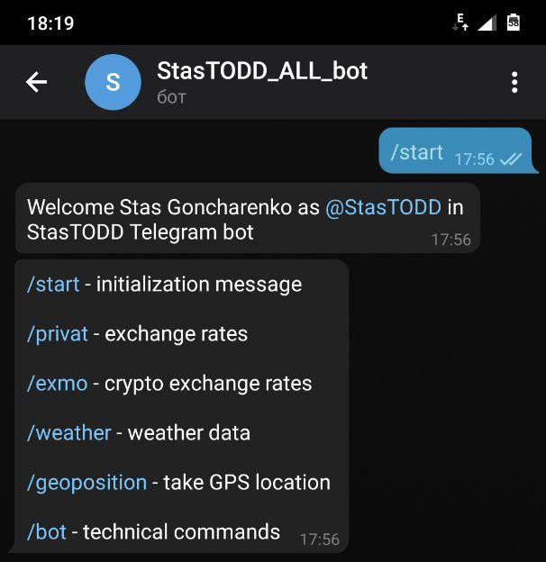
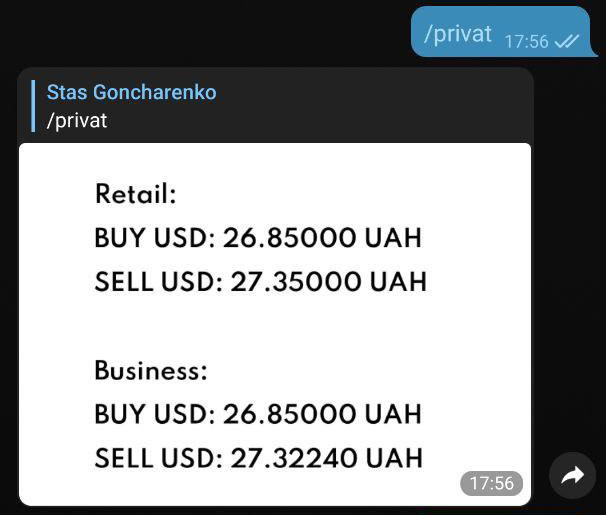
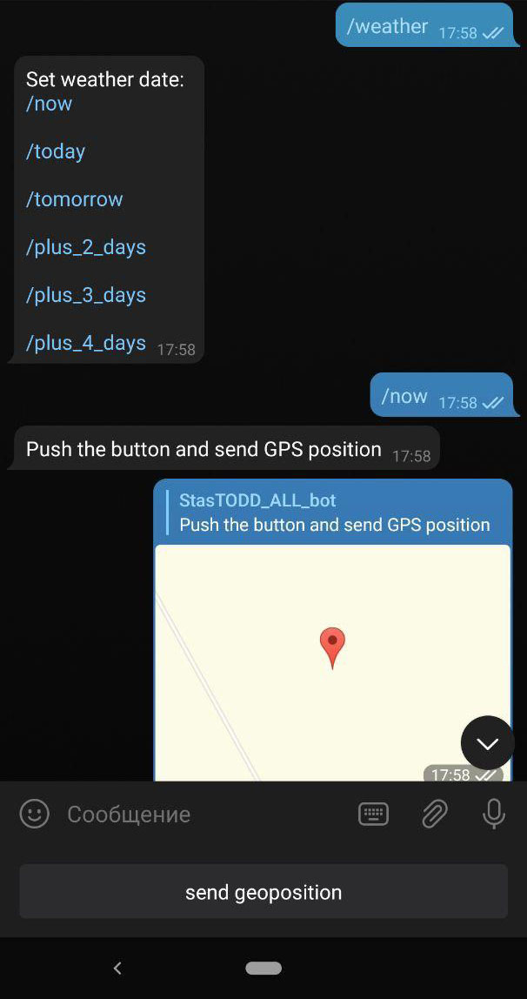
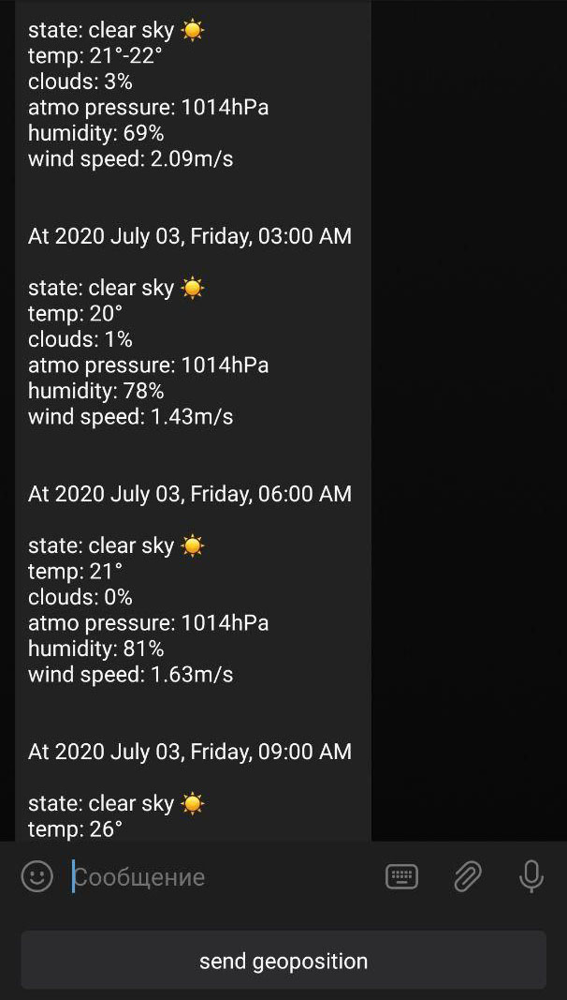
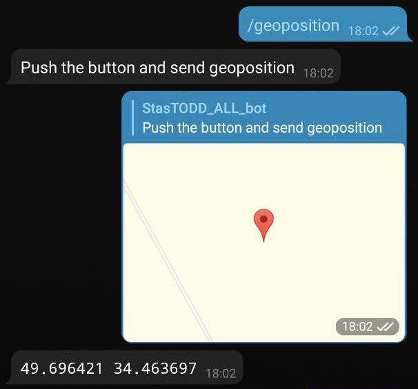
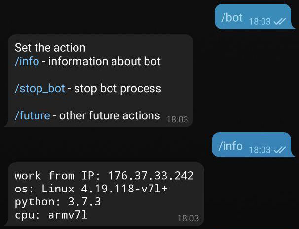
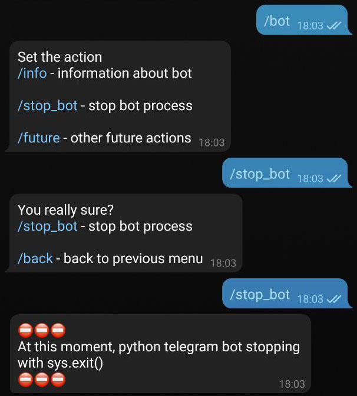
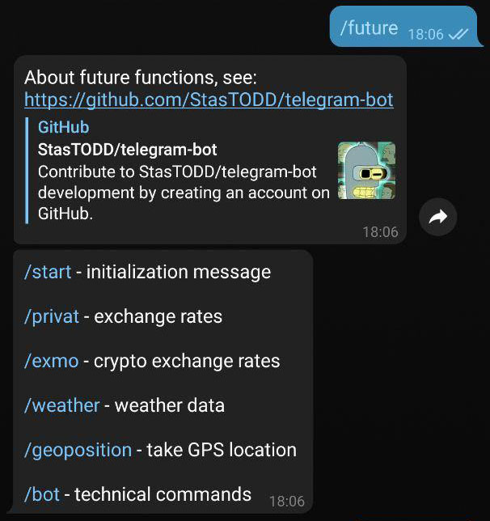

<h2 align="center">Bot-functional and examples of run commands result</h2>

### Starting message result:

### Bank Privatbank message result:

Privatbank it's one of main Ukrainian bank. It has private API using it we can get some data. Bot can get currency course. I'm adapted my parser for interested me currency pair.

### Crypto exchange platform Exmo:

How bank's Privatbank data, Exmo cryptocurrency exchange platform has analogical message result with crypto pair set.

### Weather data:

For weather data using shareware resource [openweathermap.org](https://openweathermap.org/).
For work with it need GPS positioning. At "all" mobile devices it onboard.

How it works?

1. Pick `/weather` command.
2. Set a day of weather prognose.
3. Using `send geoposition` button can send your coordinates.

### Current geoposition in text format:

Sometimes, need your GPS coordinates in text format. Bot can reply message with your coordinates at the text format.

How it works?

1. Pick `/geoposition` command.
2. Using `send geoposition` button can send your coordinates.

### `/bot` different commands:

`/info` command gather information about platform where it work:

`/stop_bot` command stop the Telegram bot process using `sys.exit()` method:

`/future` command show information about project and resend `/start` message:

